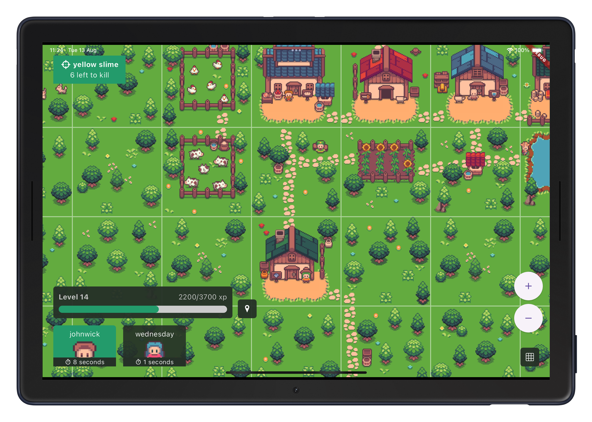

<div align="center">
 

  <h3 align="center">Flutter Artifacts MMORPG client</h3>

  <p align="center">
    Artifacts is a Sandbox MMORPG.
    <br />
    <a href="https://docs.artifactsmmo.com/"><strong>Explore the docs »</strong></a>
    <br />
    <br />
    <!-- <a href="https://artifactsmmo.com/client">View Demo</a> -->
    <a href="https://github.com/yauheniprakapenka/flutter_artifactsmmo_client/issues/new?assignees=&labels=&projects=&template=bug_report.md&title=">Report Bug</a>
    ·
    <a href="https://github.com/yauheniprakapenka/flutter_artifactsmmo_client/issues/new?assignees=&labels=&projects=&template=feature_request.md&title=">Request Feature</a>
  </p>
</div>

## Roadmap

- [x] Action move
- [x] Action fight

## Getting Started

### Auth token

Create a text file in the root directory and name it `.env`.
Open the `.env` file and paste the following lines:

```
AUTH_TOKEN=ENTER_YOUR_TOKEN
API_BASE_URL=https://api.artifactsmmo.com
```

Replace `ENTER_YOUR_TOKEN` with your authorization token.

### Launch

Use `.vscode/launch.json` to launch the project.

## License

Distributed under the MIT License. See `LICENSE.txt` for more information.

## Contact

Yauheni Prakapenka - [telegram](https://t.me/yauheniprakapenka) - yauheni.prakapenka@gmail.com
